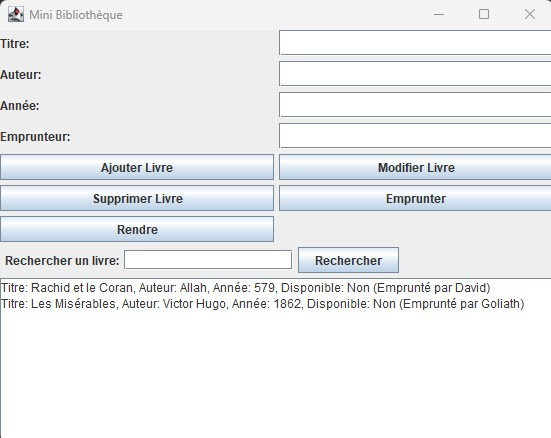
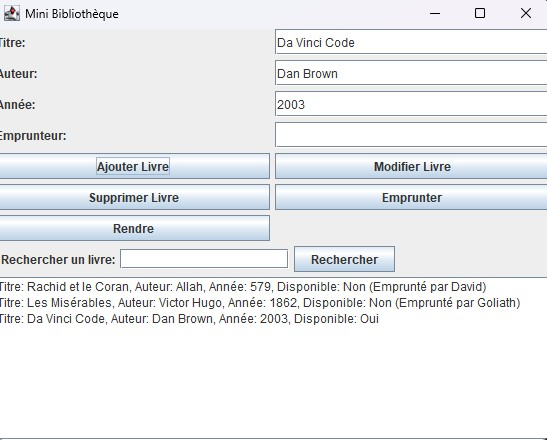

# Gestion d'une bibliothèque

## Description
Ce projet propose une interface fluide pour la gestion d'une bibliothèque.
Il permet à l'utilisateur d'ajouter, de supprimer, de mettre à jour, d'emprunter et de rendre les livres.

## Aperçu de l'application

> Les images ci-dessus montrent l'interface de la bibliothèque lors d'un affichage standard et après avoir ajouté un livre.

## Fonctionnalités 
- Interface intuitive en Java (Swing)
- Gestion complète des livres :
  - Création, suppression, mise à jour
  - Emprunt et retour
  - Recherche par titre
- Résultats affichés en temps réel

## Fonctionnalités à développer
- Ajouter un bouton "Annuler"
- Étendre les critères de recherche (année, nom de l’auteur, emprunteur)
- Améliorer l’affichage des livres pour permettre un clic et pré-remplissage des champs lors d’une modification

## Défis rencontrés
- L’oubli initial de la gestion des dates d’emprunt et de retour a nécessité une révision complète du système de suivi des livres, avec une nouvelle structure de données plus adaptée.

## Technologies utilisées

  
  
  

